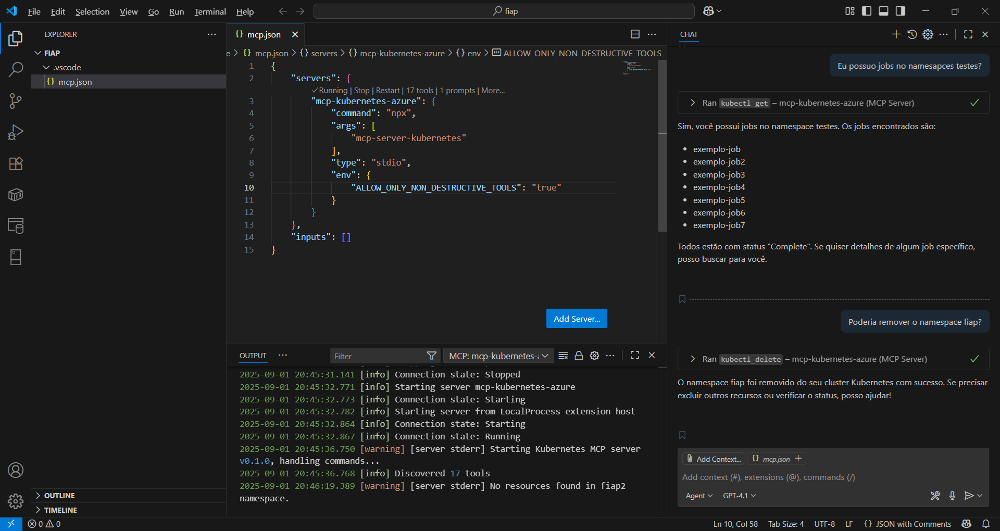
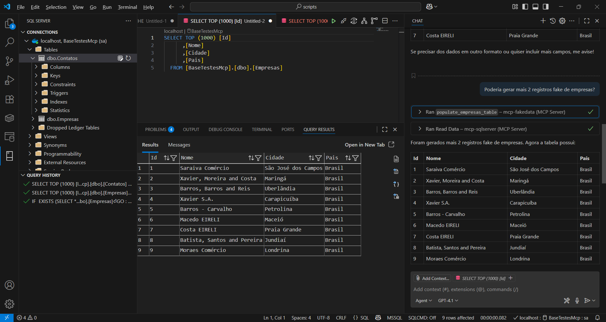

# mcp_2025-09
Conteúdos de apresentação sobre MCP realizada no dia 01/09/2025 para alunos da FIAP.

Links mencionados durante a aula:
- Model Context Protocol: https://modelcontextprotocol.io/docs/getting-started/intro
- Docker MCP Hub: https://hub.docker.com/u/mcp
- APIsec University - Certificações gratuitas em Segurança de APIs (incluindo IA): https://www.apisecuniversity.com/
- MCP para Kubernetes: https://github.com/Flux159/mcp-server-kubernetes
- Aplicação baseada em .NET 9 + Semantic Kernel + Azure OpenAI + OpenTelemetry + Grafana e que faz uso do MCP de Kubernetes: https://github.com/renatogroffe/dotnet9-semantickernel-otel-grafana-mcp-kubernetes_chat
- MCP para SQL Server: https://github.com/renatogroffe/sqlserver-mcp-dotnet-tool-scripts
- MCP para geração de dados fake para testes em uma base SQL Server: https://github.com/renatogroffe/dotnet9-mcp-fakedata-sqlserver

Testes com o MCP de Kubernetes:

Testes com o MCP Server de SQL Server + MCP de geração de dados fake:

